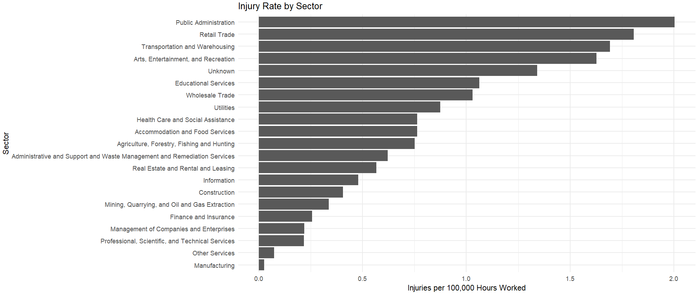
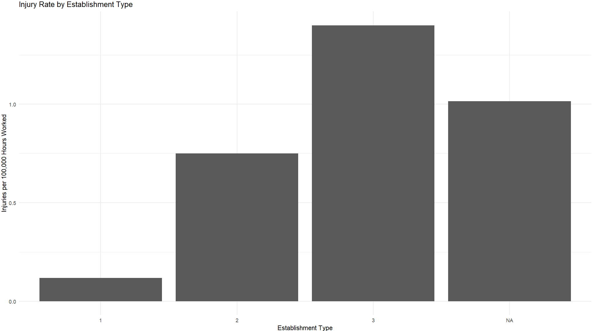
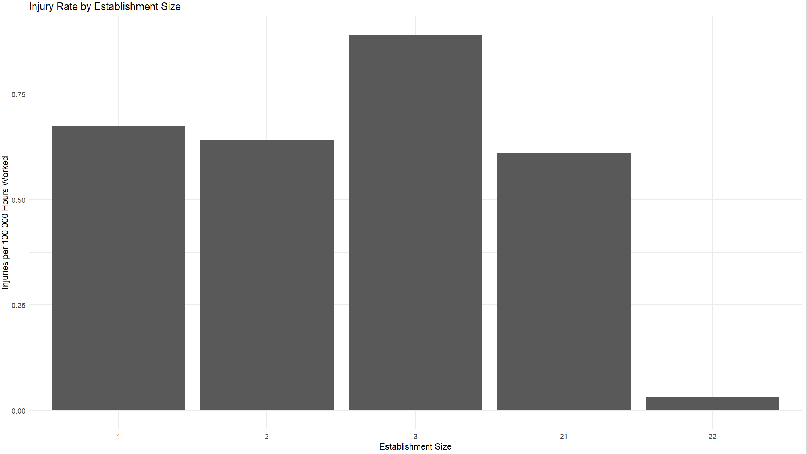
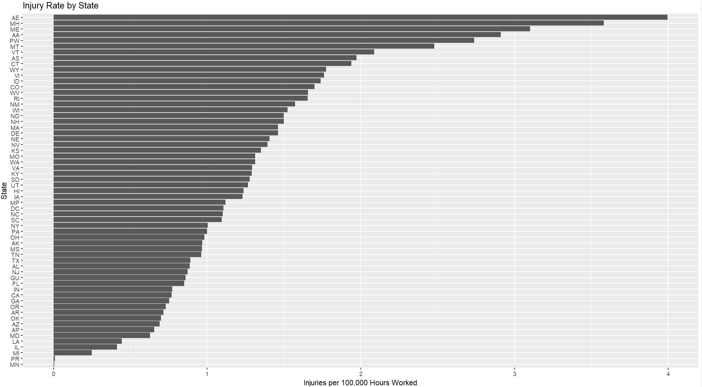

# Results

We used the OSHA 2024 Injury Tracking Application Data to complete this analysis. We used injuries per 100,000 hours worked as our metric when comparing across groups. This makes it so the data is not skewed by the number of employees that a company has or by the schedule of the employees. The mean number of employees or for a company was 350 with the median being only 42. Work time per company had a similar trend with the mean number of hours worked at accompany being 68420 while the median was 2686000 hours per year. Over the course of a year the mean company would experience 3.14 injuries and the median would only have 1 injury. This gives us a median injury per 100,000 hours worked of 1.5 and a mean of 12.1. (Maybe a boxplot of injury per 100,000 hours worked).

## Sector having an effect

The ANOVA test shows that there is a statistically significant difference in injury rates across sectors. Public administration demonstrated some of the highest injury rates, while manufacturing showed some of the lowest. (F-value: 3.001, DF: 20, p- value: 7.09e-06)//I should probably bin these section into what would be considered office work and non office work then rerun all the following comparisons SS 

## Private/Public having an effect

The anova test shows that there is a significant difference in the rate of injuries per hour in the public vs private sector with local governments demonstrating a much higher rate of injury compared to federal government or private sector work (F-value: 7.168 DF: 2, p- value: 0.000771)// I should probalbe remove the N/A section it is only about 563 samples out of 360,000+ 

##Company size having an effect

The anova test shows that there is a significant difference in the rate of injuries per hour in the size of the company as mid sized companys with 150-250 people have a significantly lower injury rate then other sized companies //should change the bins from 1, 2 to the acutual number of emplpyees (F-value: 2.714 DF: 4, p- value: 0.0282)

##States having an effect

Despite the wide range observable in the states graph the Anova test shows that there is not a significant enough effect to show that state have an effect on the injury rate of workers // I think that AE and AP are for armed forces europe and Armed forces pacific that is why we have over 50 catatiores for the states but I need look into it more(F-value: 1.189 DF: 60, p- value: 0.15)
